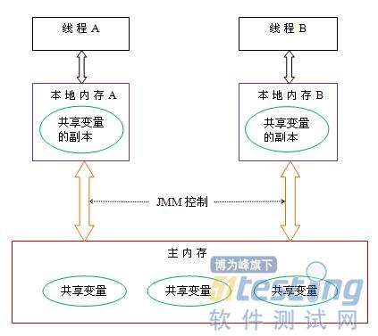
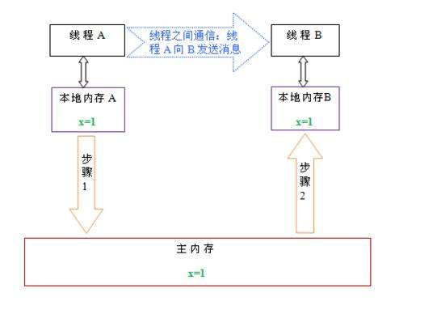
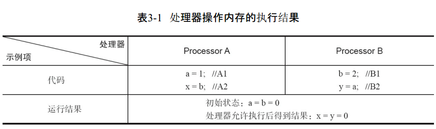
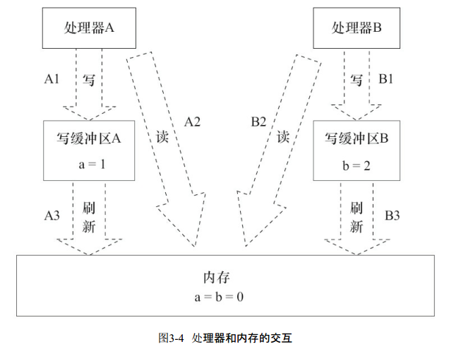
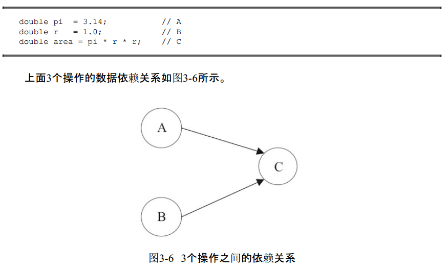
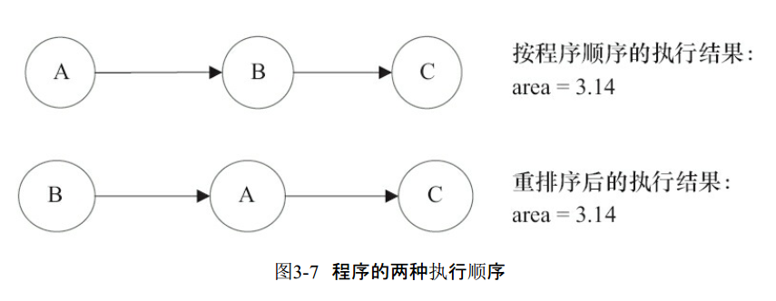
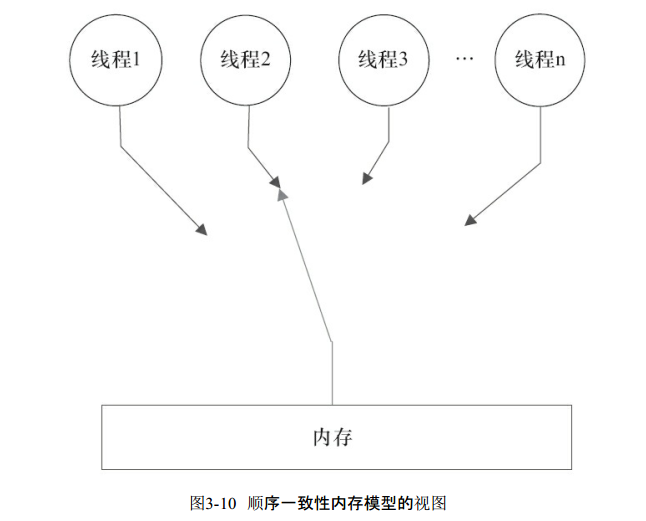
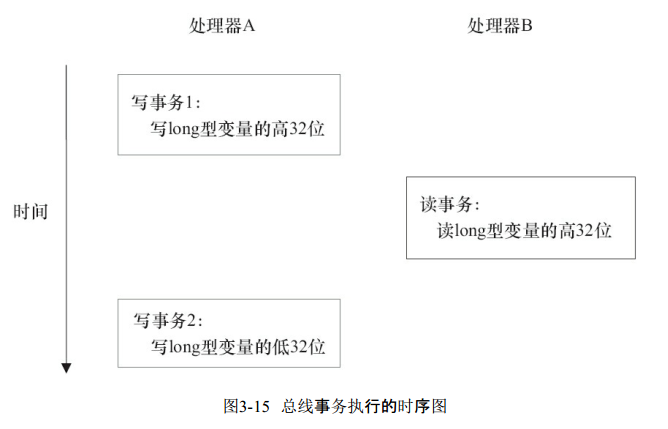
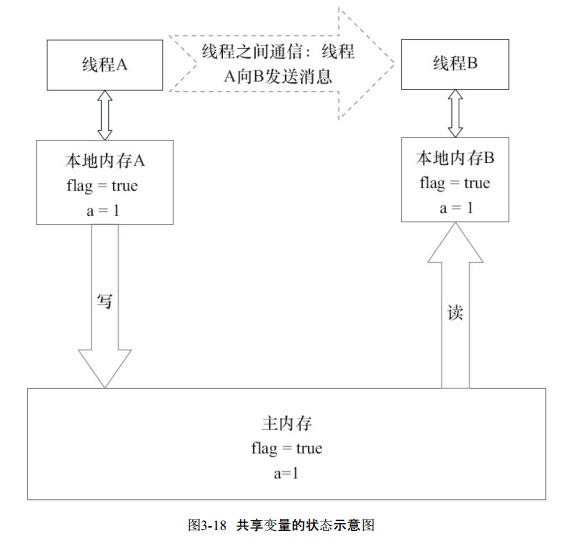

# Java内存模型

## 3.1 Java内存模型的基础

1. 并发编程模型的两个关键问题：线程之间如何通信、线程之间如何同步；
2. 在命令式编程中，线程之间的通信机制有两种：共享内存和消息传递；
3. 共享内存：线程间共享程序的公共状态，通过写-读内存中的公共状态进行隐式通信；
4. 消息传递：线程间没有公共状态，线程间必须通过发送消息来显式进行通信；
5. Java的并发采用的是共享内存模型，Java线程之间的通信总是隐式进行；
6. Java中，所有实例域、静态域和数组元素都存储在堆内存中，堆内存在线程之间共享，即他们是共享变量，而局部变量和异常处理器参数不会在线程间共享，也不会存在内存可见性问题，不受内存模型影响；
7. Java内存模型的抽象结构示意图：

>线程之间的共享变量存储在主内存中，每个线程都有一个私有的本地内存，本地内存中存储了该线程以读/写共享变量的副本

8. 线程之间的通信图：

9. 重排序作用可以提高程序性能，但同时可能会导致多线程程序出现内存可见性问题，通过内存屏障指令可以禁止特定类型的处理器重排序；
10. 重排序三种类型：编译器优化的重排序->指令级并行的重排序->内存系统的重排序,第一个属于编译器重排序，后两个是处理器重排序；
11. 处理器对内存的读/写操作的执行顺序，不一定与内存实际发生的读/写操作顺序一致，如下图示例，可能最终会得到x=y=0的结果；

12. 由于现代的处理器都会使用写缓冲区，因此现代的处理器都会允许对读-写操作进行重排序；
13. JDK1.5开始，Java使用JSR-133内存模型，而JSR-133使用happens-before的概念来阐述操作之间的内存可见性，即在JMM（Java内存模型）中，如果一个操作执行的结果需要对另一个操作可见（可在一个线程内，也可以是线程之间），那么这两个操作之间必须存在happens-before关系；
14. happens-before规则

* 程序顺序规则：一个线程中的每个操作，happens-before于该线程中的任意后续操作；
* 监视器规则：对一个锁的解锁，happens-before于随后对这个锁加锁；
* volatile变量规则：对一个volatile域的写，happens-before于任意后续对这个volatile域的读；
* 传递性：如果A happens-before B，B happens-before C，那么A happens-before C；

## 3.2 重排序

1. 定义：重排序是指编译器和处理器为了优化程序性能而对指令序列进行重新排序的一种手段；
2. 数据依赖性：仅针对单个处理器中执行的指令序列和操作，即两个操作访问同一个变量，其中一个为写操作，此时两个操作存在数据依赖性，分为写后读、写后写、读后写三种类型；
3. as-if-serial语义：意思是不管怎么重排序，（单线程）程序的执行结果不能被改变，编译器、runtime和处理器都必须遵守该语义；
4. as-if-serial语义把单线程程序保护起来，同时为编写单线程程序的程序员创建了一个幻觉，即：单线程程序是按程序的顺序来执行的；
5. 遵守as-if-serial语义，编译器和处理器不会对存在数据依赖关系的操作做重排序，即不会改变单线程程序执行结果，如下图：

上图中重排序操作A和操作B后的执行结果与操作A happens-before B顺序执行结果一致，这种情况下JMM会认为这种重排序是合法的，JMM允许这种排序；

6. 当代码中存在控制依赖性时，会影响指令序列执行的并行度；

7. 单线程对存在控制依赖的操作重排序，不会改变执行结果，而多线程中可能会改变执行结果；

## 3.3 顺序一致性

1. 设计时，处理器的内存模型和编程语言的内存模型都会以顺序一致性内存模型作为参照；
2. Java内存模型规范对数据竞争的定义如下：

* 在一个线程中写一个变量；
* 在另一个线程读同一个变量；
* 而且写和读没有通过同步来排序；

3. 如果一个多线程程序能正确同步，这个程序将是一个没有数据竞争的程序；
4. 如果程序是正确同步的，程序的执行将具有顺序一致性；
5. 顺序一致性内存模型有两大特性：

* 一个线程中的所有操作必须按照程序的顺序来执行；
* 不管程序是否同步，所有线程都只能看到一个单一的操作执行顺序，每个操作都必须是原子执行且立刻对所有线程可见；

6. 顺序一致性内存模型视图：

上图说明如下两点：

* 在任意时间点最多只能有一个线程可以连接到内存；
* 当多个线程并发执行时，图中开关设置能把所有线程的所有内存读/写操作串行化（全序关系）；

7. JMM在具体实现上的基本方针为：在不改变（正确同步）程序执行结果的前提下，尽可能地为编译器和处理器的优化打开方便之门；
8. JMM只提供最小安全性；
9. JMM不保证对64位的long型和double型变量的写操作具有原子性，而顺序一致性模型保证对所有的内存读/写都具有原子性；

> 注意，在JSR-133之前的旧内存模型中，一个64位long/double型变量的读/写操作可以被拆分为两个32位的读/写操作来执行。从JSR-133（JDK1.5）开始，仅允许把一个64位long/double型变量的写操作拆分为两个32位的写操作来执行，任意的读操作必须具有原子性，即任意读操作必须要在单个读事务中执行；

10. volatile变量自身特性：

* 可见性：对一个volatile变量的读，总是能看到（任意线程）对这个volatile变量最后的写入；
* 原子性：对任意单个volatile变量的读/写具有原子性，但类似于volatile++这种符合操作不具有原子性；

11. volatile写和锁的释放有相同的内存语义；volatile读与锁的获取有相同的内存语义；
12. volatile写和读的内存语义总结：

- 线程A写一个volatile变量，实质上是线程A向接下来将要都这个volatile变量的某个线程发出了其对共享变量所做修改的消息；
- 线程B读一个volatile变量，实质上是线程B接受了之前某个线程发出的在写这个volatile变量之前对共享变量所做修改的消息；
- 线程A写一个volatile变量，随后线程B读这个volatile变量，这个过程实质上是线程A通过主内存向线程B发送消息；

图说明：

## 锁的内存语义

1. 锁除了让临界区互斥执行外，还可以让释放锁的线程向获取同一个锁的线程发送消息；
2. 锁的内存语义与volatile读相同：

* 线程A释放一个锁，实质上是线程A向接下来将要获取这个锁的某个线程发出了（线程A对共享变量所做修改的）消息；
* 线程B获取一个锁，实质上是线程B接受了之前某个线程发出的（在释放这个锁之前对共享变量所做修改的）消息；
* 线程A释放锁，随后线程B获取这个锁，这个过程实质上是线程A通过主内存向线程B发送消息；

3. 可以通过分析ReentrantLock类源码了解锁内存语义的具体实现机制，公平锁重点看tryAcquire()方法和tryRelease()方法，非公平锁可以看CAS实现；
4. ReentrantLock分为公平锁和非公平锁，参看源码，他们的调用轨迹是不相同的；